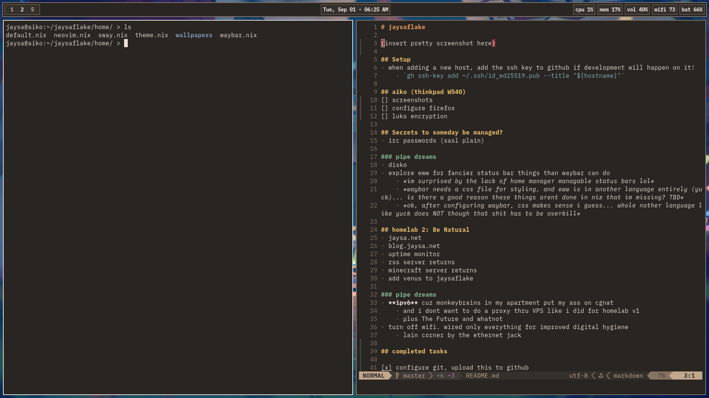

# jaysaflake

## Setup
- when adding a new host, add the ssh key to github if development will happen on it!
    - `gh ssh-key add ~/.ssh/id_ed25519.pub --title "${hostname}"`

## aiko (thinkpad W540)

[ ] screenshots

[ ] configure firefox

[ ] luks encryption

### Secrets to someday be managed?
- irc passwords (sasl plain)

### pipe dreams
- disko
- explore eww for fancier status bar things than waybar can do
    - *im surprised by the lack of home manager managable status bars lol*
    - *waybar needs a css file for styling, and eww is in another language entirely (yuck)... is there a good reason these things arent done in nix that im missing? TBD*
    - *ok, after configuring waybar, css makes sense i guess... whole nother language like yuck does NOT though that shit has to be overkill*

## homelab 2: Be Natural
- jaysa.net
- blog.jaysa.net
- uptime monitor
- rss server returns
- minecraft server returns
- add venus to jaysaflake

### pipe dreams
- **ipv6** cuz monkeybrains in my apartment put my ass on cgnat
    - and i dont want to do a proxy thru VPS like i did for homelab v1
    - plus The Future and whatnot
- turn off wifi. wired only everything for improved digital hygiene
    - lain corner by the ethernet jack

## completed tasks

[x] configure git, upload this to github
